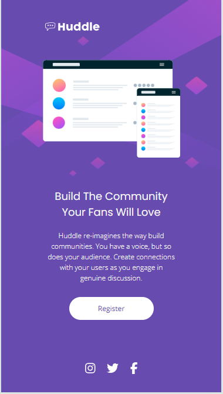

# Frontend Mentor - Landig Page Huddle
## Solução para o desafio do Frontend Mentor, onde estou praticando meus conhecimentos em HTML e CSS.

Imagem do desafio na versão para Desktop

[]

Imagem da minha resolução Desktop

[]

Imagem do desafio na versão para Mobile

[]

Imagem da minha resolução Mobile

[]

## Dificuldades

apresentei dificuldade em fazer o círculo dos icons das redes sociais e em como deixar o código mais limpo e organizado.

